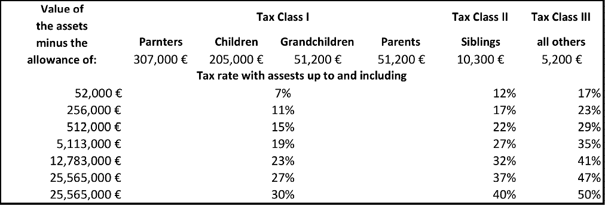
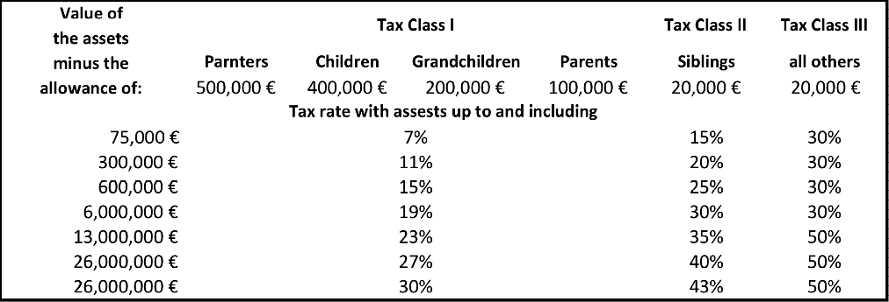
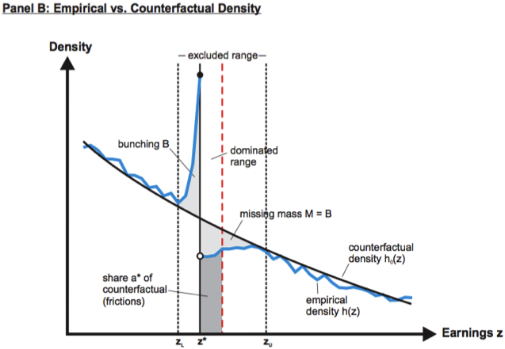

\pagebreak

# Introduction

<<<<<<< HEAD
The German inheritance tax scheme was constantly the subject of discourse and changes during the past years. On the one hand, it is discussed whether the inheritance tax is needed in general and on the other hand, the German Federal Constitutional Court (FCC) contested the fairness of the German inheritance tax scheme until 2008 but also the reformed one, which is currently in place. The first reform in 2008 took place after the FCC of Germany determined that the former inheritance tax scheme violated the principle of legal equality: The inheritance tax was raised to a marginal tax rate of up to 50% and in tax class II and III the former seven tax brackets were condensed into only two brackets (see Figues 1-3). 
=======
Insert introduction paragraphs

Justify why it is interesting:
bunching, is the gov aware of this? potential to increase revenue and increase efficiency
>>>>>>> FETCH_HEAD

<<<<<<< HEAD

=======
Note figures, include background information

>>>>>>> FETCH_HEAD

At the same moment, substantial inheritance tax reliefs for corporations and real estates have been installed. Whereas critics claim that an inheritance tax is not able to correct for fiscal imbalances (inheritance tax in Germany only accounted for 0.7% of total tax revenues in 2013), supporters argue that the inheritance tax has an important role in redistribution of wealth. The current debate centers especially around the equity versus efficiency trade-off [@piketty2013theory].

The intention of this study is to analyze behavioral responses in the self-reporting of inheritance tax to the pre- and post-reform tax schemes. For this purpose we want to use the concept of “notches” used by @kleven2013using applied to income taxation: A notch is a discontinuous jump in the tax liability and causes potential bunching because of agents that can increase both consumption and leisure by moving down below the cutoff (related to income tax). The idea behind being that only marginal higher inheritance could lead to a higher tax burden with the outcome of an actual lower net inheritance. This concept of notches provides the prediction that there is excess bunching in tax reports just below the cutoff and a density hole just above cutoff. A big advantage of the notches is that they separately identify observed and structural elasticities by using two moments (bunching and hole), whereas “kinks” provide only one moment (bunching) and identifies only the observed elasticity.

<<<<<<< HEAD
The analysis of behavioral responses to those notches in inheritance tax is relevant for several reasons. First, removing notches (and thus bunching as well) would increase tax revenue in what could be a straightforward fix for policymakers. Second, because notches are easy for taxpayers to identify and to understand, they are potentially very effective in altering their behavior [@slemrodbuenas]. Through this lens, notches can be seen as the drivers of behavioral change (i.e. empirically seen as bunching). In that sense they create an environment with high incentives for wealthy individuals to shift their behavior. Third, even though notches in inheritance taxation do not create an incentive to work or earn less, like for other types of taxes, they might trigger other ways of avoiding inheritance tax like a different declaration of assets or an excessive spending of money before ones death. These avoidance behaviors might have unexpected spillover effects [@kopczuk2010economics]. 

To date, research about behavioral responses to taxation has been conducted against the background of income taxation, never against inheritance taxation. The goal of this study is to connect these two fields of research and apply the methodology on the German inheritance tax schemes 2007-2011.
=======
Cite Kleven and Slemrod

# Research Question
>>>>>>> FETCH_HEAD

# Research Question

<<<<<<< HEAD
To what extent are behavioral responses (i.e. bunching) observable in self-reporting inheritance tax liability around discontinuous jumps – notches – in tax liability at bracket cutoffs of the pre-2009, 2009, and post-2009 tax reform scheme?

# State of the Art

Current research in behavioral responses to taxation and the field of inheritance taxation are dealt with separately so far. In a first step, a light will be shed on current inheritance research. Following, the current research frontier in behavioral responses to general taxes and transfers will be outlined that includes the state of the art methodology. 
In 2006, Helmuth Cremer pointed out in his seminal paper [@cremer2006wealth], which is limited to normative aspects of wealth transfer taxation, that there is a significant issue of avoidance and evasion that violates both vertical and horizontal equity. Despite potential “real political impact,” Cremer claims that there is little theoretical work from economists inspecting the effect of inheritance tax avoidance/evasion (ibid.).
Wojciech Kopczuk wrote in 2012 an overview article where he reviewed empirical and theoretical literature on taxation of intergenerational transfers named “Taxation of Intergenerational Transfers and Wealth.” In this paper, Kopczuk came to the conclusion that “tax avoidance is believed to be very important in practice but precise econometric evidence is scarce.” In particular, he claims that transmission channels of avoidance like charity, family structures or different types of assets were not yet analyzed by economists [@kopczuk2012taxation].
The current state of the art in methodology on behavioral responses to taxes and transfers is almost exclusively originated in the field of income taxation. It focuses more and more on quasi-experimental work based on clear identification, whereas survey data is ruled out by administrative data. Moreover, a distinction between observed vs. structural elasticities is made in the presence of optimization frictions (adjustment costs, etc.) [@kleven2013using]. To analyze behavioral responses recent papers applied the following methodologies: Saez (2010), Chetty et al. (2011), Kleven and Waseem (2012), and Chetty et al. in 2013 dealt with bunching approaches and optimization frictions. Kleven, Landais, and Saez in 2012 as well as Kleven, Landais, Saez, and Schultz in 2013 ran a difference-in-differences approach. Finally, Saez, Matsaganis, and Tsakloglou used a regression discontinuity design in 2012 (cite this).
=======
# State of the Art

More detail, paucity of research
>>>>>>> FETCH_HEAD

In detail, regarding the bunching approach that will be used also in this study, Kleven and Waseem laid down the blueprint for the notch-methodology in their paper of 2013 “Using notches to uncover optimization frictions and structural elasticities: theory and evidence from Pakistan.” Their main finding is that they detect large and sharp excess bunching below every notch combined with missing mass (holes) above every notch. Moreover, despite large bunching responses, optimization frictions weaken this behavior. In detail they would assume bunching to be 10 times larger than what we observe for wage earners an two to five times larger than what we observe for the self-employed without those frictions. Concerning elasticities, they found a relatively modest underlying structural elasticity. The amount of dominated behavior (slowly) declines over time, so that the observed elasticity gets closer to the frictionless structural elasticity [@kleven2013using].

<<<<<<< HEAD
Finally, in a more recent paper about housing market responses to transaction taxes  Best and Kleven analyzed the distortion arising from notches. They come to the conclusion that “it is not the existence of notches *per se* that makes the transaction tax so distortionary. The large distortions arise from the strong underlying responsiveness to the tax, which we are able to identify using notches and other sources of exogenous variation” [@best2014housing].
=======
Methodology for answering questions, potential methods.
>>>>>>> FETCH_HEAD

# Methods

Blah, blah, blah

## Data

<<<<<<< HEAD
In order to examine the self-reporting at discontinuous jumps in tax liability (notches), we intend to base the study on the inheritance and gift tax statistics (*Erbschafts- und Schenkungsteuerstatistik*) of the German Federal Bureau of Statistics (*Destatis*). It is exhaustive data, which is a significant advantage and crucial to detect bunching precisely [@KlevenLent2013]. The first census took place in 2002, the next in 2007 and from then annually with very detailed survey characteristics. For our purposes the following characteristics are important: size of inheritance, type of assets, tax bracket, year when the tax was declared, and type of relationship to the bequeathed. The German *Länder* collected the data. The intention is to use the data of the five latest years available, 2007 to 2011. The reform of the inheritance tax scheme took place in two steps in 2009 and 2010. Thus, this period allows to not only compare bunching within the respective tax scheme (brackets), but also between different (reformed) tax schemes. 
=======
Two examples
>>>>>>> FETCH_HEAD

## Empirical Strategy

To examine the expected bunching, a cross-sectional comparison is applied. The concrete empirical strategy is laid down by Kleven and Waseem (2013): The analysis of bunching will be based on a comparison between the empirical distribution and an estimated counterfactual distribution. In their paper they estimated the counterfactual for each notch separately by fitting a polynomial to the empirical distribution, excluding data around the notch. In Figure 4 the empirical distribution is plotted against the counterfactual (estimated) distribution.

The analysis will contain an examination of bunching for every year 2007 to 2011. Moreover, the analysis will be run for each tax class (I, II and III) separately. The reform condensed the respective tax brackets in 2009 for tax class II and III from 7 brackets to only two. In 2010, tax class II was changed back again to 7 brackets. Against this background the question about how the bunching behavior changed when the tax brackets were condensed after the tax reforms will be assessed.

The final goal will be to derive an elasticity of (reported) bequest dependent on the tax burden.

<<<<<<< HEAD
## Second Best Research Approach

Given potential data limitations, we have built in a second best approach for our analysis of inheritance taxation. First, it is still promising that we would be able to at least get a first look at the data mentioned already (current timeline: mid-November). 

Built into attempting to answer our research question must be an analysis of the aforementioned notches. For this, we plan to create our own dataset from scratch, using the German tax scheme, for given incomes, years, individuals, and tax classes.  Thus, we are able to derive tax burden functions, which demonstrate the tax burden dependent on the bequest. Here, our focus will be to represent this in a visual (hopefully, interactive) graphic to point out the potential need for further analysis. 
=======
Only in bullet point form now

## Working Steps

Only in bullet point format now

## Data Availability

Rearrange this last part

## Second Best Approach
>>>>>>> FETCH_HEAD

# Limitations

Our biggest limitation in our approach, especially regarding our second-best approach, is that we need to be completely aware when which law and/or reform was implemented and how the changes went into place. Thus, it is important to precisely identify the point and time changes occurred. Moreover, we need to understand the nuances of the reforms (especially certain special cases or exemptions) in order to create an accurate dataset that could show potential notches. Furthermore, German *Länder* use different monitoring procedure. Especially North Rhine-Westphalia had problems monitoring in the beginning. We need to be aware of potential filing exemptions and non-compliance. Finally, given that the threshold for taxing inheritances is quite high, those that pay inheritance tax represent a small subsample of the population. Nonetheless, we believe that much can be discerned from an exploration into notches and attempting to understand tax-payer behavioral changes (if any).

\pagebreak

# Reference of Software

This project used @CiteRStudio to create this research proposal.

# References

